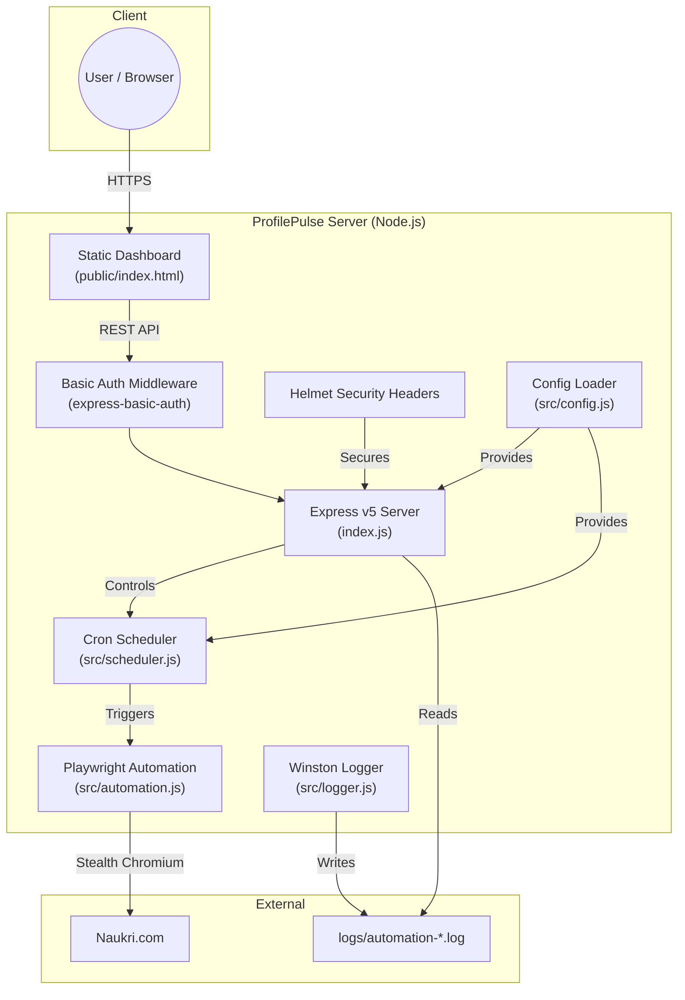
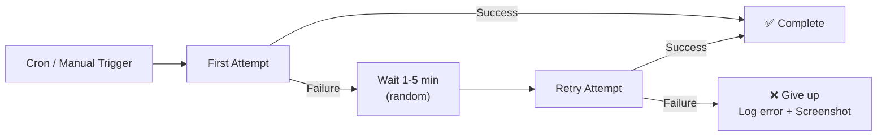

<p align="center">
  <h1 align="center">⚡ ProfilePulse</h1>
  <p align="center">
    <strong>Automated Naukri Profile Optimizer — Keep your profile visible. Always.</strong>
  </p>
  <p align="center">
    
    
    
    
    
  </p>
</p>

---

## Table of Contents

- [Overview](#overview)
- [Key Features](#key-features)
- [System Architecture](#system-architecture)
- [Project Structure](#project-structure)
- [Technology Stack](#technology-stack)
- [Prerequisites](#prerequisites)
- [Installation](#installation)
- [Configuration](#configuration)
- [Usage](#usage)
  - [Web Dashboard](#web-dashboard)
  - [CLI Mode](#cli-mode)
- [API Reference](#api-reference)
- [How It Works — Automation Deep Dive](#how-it-works--automation-deep-dive)
- [Deployment](#deployment)
  - [Render (Recommended)](#render-recommended)
  - [Railway](#railway)
- [Security Considerations](#security-considerations)
- [Logging & Monitoring](#logging--monitoring)
- [Troubleshooting](#troubleshooting)
- [Contributing](#contributing)
- [License](#license)

---

## Overview

**ProfilePulse** is a production-grade automation tool that keeps your [Naukri.com](https://www.naukri.com) profile active and highly ranked in recruiter searches. Naukri's search algorithm heavily favours recently updated profiles — ProfilePulse automates micro-updates (toggling a skill) at configurable intervals so your profile stays at the top without any manual effort.

It ships with a **secure, real-time web dashboard** for controlling schedules, triggering manual runs, and viewing live logs — all accessible from any device.

### Problem Statement

Naukri.com ranks profiles by "last updated" timestamp. Profiles that haven't been modified recently drop in recruiter search results, reducing visibility and job opportunities. Manually editing your profile every day is tedious and easy to forget.

### Solution

ProfilePulse runs a headless Chromium browser on a schedule, authenticates via saved session cookies, and performs a two-pass **skill toggle** (remove → re-add a skill). This updates your profile's timestamp without altering your actual content, keeping you perpetually visible to recruiters.

---

## Key Features

| Feature                          | Description                                                                                       |
| :------------------------------- | :------------------------------------------------------------------------------------------------ |
| 🔄 **Automated Profile Refresh** | Two-pass skill toggle updates your "last modified" timestamp without changing profile content.    |
| 🛡️ **Anti-Bot Stealth**          | Uses `playwright-extra` with the Puppeteer Stealth plugin to bypass Naukri's bot detection.       |
| 🍪 **Cookie-Based Auth**         | Authenticates via exported browser cookies — avoids OTP challenges on new IPs.                    |
| 📊 **Real-Time Dashboard**       | Modern dark-mode web UI with live status, schedule controls, and color-coded log viewer.          |
| ⏰ **Flexible Scheduling**       | Interval-based, time-based, or raw CRON expressions — all configurable from the dashboard.        |
| 🔁 **Automatic Retries**         | Failed runs retry after a randomized 1–5 minute delay before giving up.                           |
| 🔒 **Security First**            | Helmet.js headers, HTTP Basic Auth, `textContent`-based log rendering (XSS-safe), `.env` secrets. |
| 📝 **Rotating Logs**             | Winston logger with daily rotation (5 MB cap, 3-day retention).                                   |
| 📸 **Error Screenshots**         | Captures browser screenshots on failure for debugging; auto-cleans to last 3.                     |
| 🏠 **Self-Ping Keep-Alive**      | Prevents Render free-tier cold starts with a 14-minute self-ping interval.                        |

---

## System Architecture



### Data Flow

```
1. User → Dashboard (HTTP Basic Auth) → Express API
2. Express ↔ Scheduler (start/stop/reschedule)
3. Scheduler → Automation (on cron tick or manual trigger)
4. Automation → Launch headless Chromium → Inject cookies → Navigate Naukri
5. Automation → Two-pass skill toggle (remove Python → save → re-add Python → save)
6. Logger → Rotating log files → Dashboard reads & displays
```

---

## Project Structure

```
NaukriAutoUpdate/
├── index.js                  # Application entry point — Express server + API routes
├── package.json              # Dependencies and npm scripts
├── .env                      # Environment variables (secrets — git-ignored)
├── .env.example              # Template for required environment variables
├── .gitignore                # Git exclusion rules
├── HOSTING_PLAN.md           # Cloud deployment guide
│
├── src/
│   ├── automation.js         # Core Playwright automation logic (profile update)
│   ├── scheduler.js          # Cron job management with retry logic
│   ├── config.js             # Centralized configuration + env validation
│   ├── logger.js             # Winston logger with daily file rotation
│   └── utils/
│       └── time.js           # Random delay utility (anti-detection)
│
├── public/
│   └── index.html            # Single-page dashboard UI (dark theme)
│
├── logs/                     # Runtime logs and error screenshots (git-ignored)
│   ├── automation-YYYY-MM-DD.log
│   └── error-*.png
│
└── schemas/                  # Reserved for future data schemas
```

---

## Technology Stack

| Layer                  | Technology                          | Purpose                                 |
| :--------------------- | :---------------------------------- | :-------------------------------------- |
| **Runtime**            | Node.js ≥ 18                        | Server-side JavaScript execution        |
| **Web Framework**      | Express v5                          | REST API and static file serving        |
| **Browser Automation** | Playwright + playwright-extra       | Headless Chromium control               |
| **Anti-Detection**     | puppeteer-extra-plugin-stealth      | Bypass bot detection fingerprinting     |
| **Task Scheduling**    | node-cron                           | Configurable cron-based job scheduling  |
| **Logging**            | Winston + winston-daily-rotate-file | Structured, rotating log management     |
| **Security**           | Helmet.js + express-basic-auth      | HTTP headers hardening + Basic Auth     |
| **Configuration**      | dotenv                              | Environment variable management         |
| **Frontend**           | Vanilla HTML/CSS/JS                 | Zero-dependency dashboard UI            |
| **Hosting**            | Render / Railway                    | Cloud deployment (free tier compatible) |

---

## Prerequisites

- **Node.js** ≥ 18.0.0
- **npm** ≥ 9.0.0
- A **Naukri.com** account with an active profile
- A **Chromium-compatible** browser (auto-installed by Playwright)
- The [Cookie-Editor](https://cookie-editor.cgagnier.ca/) browser extension (for exporting session cookies)

---

## Installation

### 1. Clone the Repository

```bash
git clone https://github.com/<your-username>/NaukriAutoUpdate.git
cd NaukriAutoUpdate
```

### 2. Install Dependencies

```bash
npm install
```

### 3. Install Playwright Browsers

```bash
npx playwright install chromium
```

> **Note:** On Render or other cloud platforms, the build command in `package.json` handles this automatically:
>
> ```bash
> npm run build   # Runs: PLAYWRIGHT_BROWSERS_PATH=0 npx playwright install chromium
> ```

### 4. Configure Environment

```bash
cp .env.example .env
```

Edit `.env` with your credentials (see [Configuration](#configuration) below).

### 5. Start the Application

```bash
npm start
```

The dashboard will be available at **http://localhost:8080**.

---

## Configuration

All configuration is managed through environment variables in the `.env` file.

### Required Variables

| Variable          | Type          | Description                                           |
| :---------------- | :------------ | :---------------------------------------------------- |
| `NAUKRI_EMAIL`    | `string`      | Your Naukri.com account email address.                |
| `NAUKRI_PASSWORD` | `string`      | Your Naukri.com account password.                     |
| `NAUKRI_COOKIES`  | `JSON string` | Exported browser cookies from Naukri.com (see below). |

### Optional Variables

| Variable                   | Type      | Default        | Description                                                           |
| :------------------------- | :-------- | :------------- | :-------------------------------------------------------------------- |
| `DASHBOARD_PASSWORD`       | `string`  | `admin`        | Password for the web dashboard (username is always `admin`).          |
| `CRON_SCHEDULE`            | `string`  | `0 9,21 * * *` | Cron expression for automation schedule (default: 9 AM & 9 PM daily). |
| `HEADLESS_BROWSER`         | `boolean` | `true`         | Set to `false` to see the browser window during execution.            |
| `PORT`                     | `number`  | `8080`         | Port for the Express web server.                                      |
| `PLAYWRIGHT_BROWSERS_PATH` | `string`  | —              | Set to `0` on Render to use local Chromium installation.              |
| `RENDER_EXTERNAL_URL`      | `string`  | —              | Auto-set by Render; enables the self-ping keep-alive mechanism.       |

### Exporting Naukri Cookies

The automation uses **cookie-based authentication** to bypass OTP verification triggered by new IP addresses (common on cloud servers).

1. Install the [Cookie-Editor](https://cookie-editor.cgagnier.ca/) browser extension.
2. Log into **naukri.com** in your browser.
3. Open Cookie-Editor → click **Export** → choose **JSON format**.
4. Paste the entire JSON array as a single-line value for `NAUKRI_COOKIES` in your `.env` file.

> ⚠️ **Important:** Cookies expire approximately every **30 days**. When the automation starts failing with "Session cookies are expired" errors, re-export fresh cookies and update `NAUKRI_COOKIES`.

### Example `.env`

```env
# Authentication (Cookie-based)
NAUKRI_COOKIES='[{"name":"nauk_at","value":"...","domain":".naukri.com",...}]'

# Naukri credentials (kept for reference)
NAUKRI_EMAIL=your_email@example.com
NAUKRI_PASSWORD=your_password

# Schedule (default: 9 AM and 9 PM daily)
# CRON_SCHEDULE="0 9,21 * * *"

# Dashboard security
DASHBOARD_PASSWORD=your_secure_password_here

# Playwright (required on Render)
PLAYWRIGHT_BROWSERS_PATH=0
```

---

## Usage

### Web Dashboard

Access the dashboard at `http://localhost:8080` (or your deployed URL).

**Login:** Username = `admin`, Password = your `DASHBOARD_PASSWORD`.

#### Dashboard Sections

| Section             | Functionality                                                                |
| :------------------ | :--------------------------------------------------------------------------- |
| **Status Overview** | Live scheduler state, current schedule (human-readable), and browser mode.   |
| **Update Schedule** | Choose from preset intervals (4h / 6h / 12h / daily) or set a specific time. |
| **Quick Actions**   | Trigger an immediate profile update or open your Naukri profile.             |
| **Activity Logs**   | Color-coded real-time logs (auto-refreshes every 8 seconds).                 |

#### Dashboard Controls

- **Pause / Resume** — Toggle the cron scheduler on/off.
- **Run Update Now** — Trigger an immediate automation run (async; watch logs for results).
- **Refresh Logs** — Manually refresh the log viewer.

### CLI Mode

For one-off manual runs without starting the web server:

```bash
npm run start:manual
# or
node index.js --manual
```

This executes a single profile update and exits.

---

## API Reference

All endpoints require **HTTP Basic Auth** (`admin` / `DASHBOARD_PASSWORD`).

### `GET /api/status`

Returns current system status.

**Response:**

```json
{
  "status": "running",
  "cronSchedule": "0 9,21 * * *",
  "headless": true
}
```

| Field          | Type      | Values                                |
| :------------- | :-------- | :------------------------------------ |
| `status`       | `string`  | `"running"` or `"stopped"`            |
| `cronSchedule` | `string`  | Active cron expression                |
| `headless`     | `boolean` | Whether browser runs in headless mode |

---

### `POST /api/toggle-scheduler`

Pauses or resumes the cron scheduler.

**Response:**

```json
{
  "success": true,
  "message": "Scheduler stopped."
}
```

---

### `POST /api/manual`

Triggers an immediate profile update (non-blocking).

**Response:**

```json
{
  "success": true,
  "message": "Execution started! Check dashboard logs."
}
```

---

### `POST /api/schedule`

Updates the cron schedule. Validates the expression and persists it to `.env`.

**Request Body:**

```json
{
  "schedule": "0 */6 * * *"
}
```

**Response (success):**

```json
{
  "success": true,
  "message": "Schedule updated successfully!"
}
```

**Response (invalid cron):**

```json
{
  "success": false,
  "message": "Invalid CRON expression."
}
```

---

### `GET /api/logs`

Returns the last 50 lines from the most recent log file.

**Response:**

```json
{
  "success": true,
  "logs": [
    "2026-03-04 09:00:01 [INFO]: Cron job triggered!",
    "2026-03-04 09:00:02 [INFO]: Starting Naukri Profile Update automation..."
  ]
}
```

---

## How It Works — Automation Deep Dive

The automation engine (`src/automation.js`) executes a **two-pass skill toggle** strategy:

### Pass 1 — Remove Skill

```
1. Launch headless Chromium (stealth mode, custom user-agent)
2. Inject saved session cookies into browser context
3. Navigate to Naukri homepage → verify session is valid
4. Navigate to profile page
5. Locate "Key skills" section → click edit icon
6. Find the "Python" skill chip → click its ✕ button to remove
7. Click Save
```

### Pass 2 — Re-Add Skill

```
8. Re-navigate to profile page (fresh load)
9. Re-locate "Key skills" section → click edit icon
10. Find the skill input field → type "Python"
11. Select from autocomplete suggestions (or press Enter)
12. Click Save
```

### Anti-Detection Measures

| Technique                | Implementation                                                        |
| :----------------------- | :-------------------------------------------------------------------- |
| **Stealth Plugin**       | `puppeteer-extra-plugin-stealth` patches browser fingerprinting APIs. |
| **Random Delays**        | Human-like pauses (1–7 seconds) between actions via `randomDelay()`.  |
| **Realistic User-Agent** | Mimics Chrome 120 on Windows 10.                                      |
| **Viewport Emulation**   | Standard 1280×800 resolution.                                         |
| **Keyboard Typing**      | Character-by-character input with 200ms delay per keystroke.          |

### Error Handling



- **Automatic retry** with randomized 1–5 minute backoff on first failure.
- **Error screenshots** saved to `logs/error-<timestamp>.png` (keeps latest 3).
- All errors are logged with full stack traces to rotating log files.

---

## Deployment

### Render (Recommended)

Render provides a free tier that supports long-running Node.js services.

#### Step-by-Step

1. Push your code to a **private** GitHub repository.
2. Sign up at [render.com](https://render.com) → **New +** → **Web Service**.
3. Connect your GitHub repository.
4. Configure the service:

   | Setting           | Value                          |
   | :---------------- | :----------------------------- |
   | **Name**          | `profilepulse`                 |
   | **Environment**   | `Node`                         |
   | **Build Command** | `npm install && npm run build` |
   | **Start Command** | `npm start`                    |

5. Add **Environment Variables** in the Render dashboard:
   - `NAUKRI_EMAIL`
   - `NAUKRI_PASSWORD`
   - `NAUKRI_COOKIES`
   - `DASHBOARD_PASSWORD` (use a strong password)
   - `HEADLESS_BROWSER` = `true`
   - `PLAYWRIGHT_BROWSERS_PATH` = `0`

6. Click **Deploy**.

#### Cold Start Mitigation

Render's free tier spins down services after 15 minutes of inactivity. ProfilePulse includes a **self-ping mechanism** that sends an HTTPS request to itself every 14 minutes (using `RENDER_EXTERNAL_URL`, which Render sets automatically) to prevent cold starts.

### Railway

1. Connect your GitHub repo to [Railway](https://railway.app).
2. Add the same environment variables in the **Variables** tab.
3. Railway auto-detects `package.json` and starts the server.

---

## Security Considerations

| Area                   | Implementation                                                                                |
| :--------------------- | :-------------------------------------------------------------------------------------------- |
| **Secrets Management** | All credentials stored in `.env`, excluded from Git via `.gitignore`.                         |
| **HTTP Headers**       | Helmet.js sets `X-Content-Type-Options`, `X-Frame-Options`, `Strict-Transport-Security`, etc. |
| **Authentication**     | HTTP Basic Auth with configurable password; default (`admin`) triggers a warning.             |
| **XSS Prevention**     | Dashboard log viewer uses `textContent` (not `innerHTML`) to render user-controlled data.     |
| **Input Validation**   | Cron expressions validated via `node-cron.validate()` before acceptance.                      |
| **CSP**                | Content Security Policy disabled for inline styles/scripts (single-file dashboard).           |

### Security Best Practices

> ⚠️ **Always change the default dashboard password** from `admin` to a strong, unique value.

> ⚠️ **Never commit your `.env` file** to version control. The `.gitignore` is pre-configured to exclude it.

> ⚠️ **Rotate Naukri cookies** every ~30 days when sessions expire.

---

## Logging & Monitoring

### Log Format

```
YYYY-MM-DD HH:mm:ss [LEVEL]: Message
```

**Example:**

```
2026-03-04 09:00:01 [INFO]: Cron job triggered!
2026-03-04 09:00:03 [INFO]: Starting Naukri Profile Update automation...
2026-03-04 09:00:05 [INFO]: Injected 42 session cookies. Skipping login form.
2026-03-04 09:00:15 [INFO]: Session verified. Logged in successfully via cookies.
2026-03-04 09:01:30 [INFO]: Successfully executed Key Skills two-pass toggle update.
```

### Log Rotation Policy

| Parameter         | Value                                     |
| :---------------- | :---------------------------------------- |
| **File Pattern**  | `logs/automation-YYYY-MM-DD.log`          |
| **Max File Size** | 5 MB per file                             |
| **Retention**     | 3 days (older logs auto-deleted)          |
| **Compression**   | Disabled (saves CPU on free-tier hosting) |

### Log Levels

| Level   | Color (Dashboard) | Usage                                     |
| :------ | :---------------- | :---------------------------------------- |
| `INFO`  | 🔵 Blue           | Normal operations, progress updates       |
| `WARN`  | 🟡 Yellow         | Non-critical issues, fallback paths taken |
| `ERROR` | 🔴 Red            | Failures, exceptions, critical issues     |

---

## Troubleshooting

### Common Issues

#### ❌ "Session cookies are expired or invalid"

**Cause:** Your `NAUKRI_COOKIES` have expired (typically after ~30 days).
**Fix:** Re-export cookies from your browser while logged into Naukri and update the env variable.

#### ❌ "NAUKRI_COOKIES env var is not set"

**Cause:** The `NAUKRI_COOKIES` environment variable is missing.
**Fix:** Export cookies as described in [Configuration](#exporting-naukri-cookies) and set the variable.

#### ❌ "Could not find Key skills edit icon"

**Cause:** Naukri's UI structure may have changed, or the page didn't load fully.
**Fix:** Check error screenshots in `logs/`. If the issue persists, the CSS selectors in `automation.js` may need updating.

#### ❌ Dashboard shows "Waiting for logs..."

**Cause:** No automation run has been executed yet, or log files are empty.
**Fix:** Click "Run Update Now" to trigger a manual execution and wait for logs to populate.

#### ❌ Render deployment fails with Playwright errors

**Cause:** Chromium binary not installed during build.
**Fix:** Ensure your build command includes `npm run build` (which runs `PLAYWRIGHT_BROWSERS_PATH=0 npx playwright install chromium`).

#### ⚠️ "Using default dashboard password"

**Cause:** `DASHBOARD_PASSWORD` is not set in `.env`.
**Fix:** Set a strong password: `DASHBOARD_PASSWORD=your_secure_password`.

---

## Contributing

1. **Fork** the repository.
2. Create a **feature branch**: `git checkout -b feature/your-feature`.
3. **Commit** your changes: `git commit -m "feat: add your feature"`.
4. **Push** to the branch: `git push origin feature/your-feature`.
5. Open a **Pull Request**.

### Code Style

- CommonJS modules (`require` / `module.exports`)
- Winston for all logging (never use `console.log` in production code)
- Async/await for all asynchronous operations
- Human-readable random delays between automation steps

---

## License

This project is licensed under the **ISC License**. See the [LICENSE](LICENSE) file for details.

---

<p align="center">
  <sub>Built for professional profile management • Keep your profile visible. Always.</sub>
</p>
