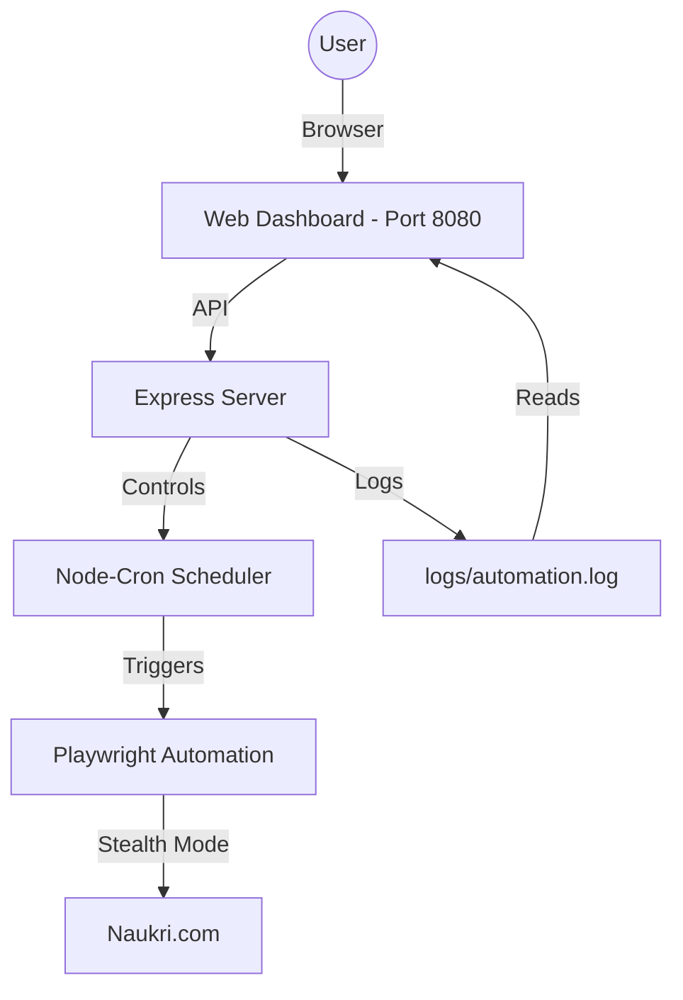

# ProfilePulse: Naukri Profile Automation

ProfilePulse is a professional automation tool designed to keep your Naukri profile active and visible to recruiters by performing periodic updates and skill toggling. It features a secure web dashboard for easy control and scheduling.

## 🏗 System Architecture



## 🚀 Features

- **Automatic Search Ranking Boost**: Simulates activity to keep your profile at the top of recruiter searches.
- **Secure Web Dashboard**: Change settings, trigger manual runs, and view logs from any device.
- **Anti-Bot Protection**: Uses Playwright Stealth to bypass sophisticated detection.
- **Smart Scheduling**: Human-readable scheduling (Daily, Intervals, or Specific Times).
- **Security First**: Credential management via environment variables and Basic Auth protection.

## 🛠 Project Structure

- `index.js`: Main entry point, Express server, and API routing.
- `src/automation.js`: Core Playwright logic for profile interaction.
- `src/scheduler.js`: Manages recurring tasks and dynamic re-scheduling.
- `src/config.js`: Centralized configuration and environment validation.
- `public/index.html`: Modern, responsive dashboard interface.
- `logs/`: Stores execution history and error screenshots.

## ⚙️ Configuration (.env)

| Variable             | Description                                       |
| :------------------- | :------------------------------------------------ |
| `NAUKRI_EMAIL`       | Your Naukri account email.                        |
| `NAUKRI_PASSWORD`    | Your Naukri account password.                     |
| `DASHBOARD_PASSWORD` | Password to access the web UI (default: `admin`). |
| `CRON_SCHEDULE`      | (Optional) Custom CRON string.                    |
| `HEADLESS_BROWSER`   | Set to `true` for background runs.                |

## 📦 Installation & Setup

1.  **Install dependencies**:
    ```bash
    npm install
    ```
2.  **Setup Environment**:
    Create a `.env` file based on `.env.example`.
3.  **Start the app**:
    ```bash
    npm start
    ```
4.  **Access UI**:
    Go to `http://localhost:8080` (User: `admin`).

---

Developed for professional profile management.
